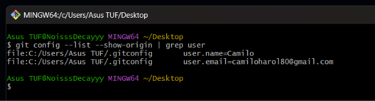
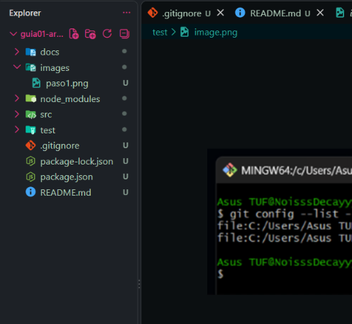

Nombre completo del estudiante.
CAMILO HAROL CONDE YUCRA

• Una breve descripción del curso.
Arquitectura de Software es un diseño de alto nivel.

• Expectativas del estudiante respecto al curso.
Aprender todo sobre la arquitectura de software.

• Nombre completo del docente.
LIZBETH JAICO QUISPE

• Además incluir la captura de imágenes del paso 1 y paso 2

## Paso 1

## Paso 2
